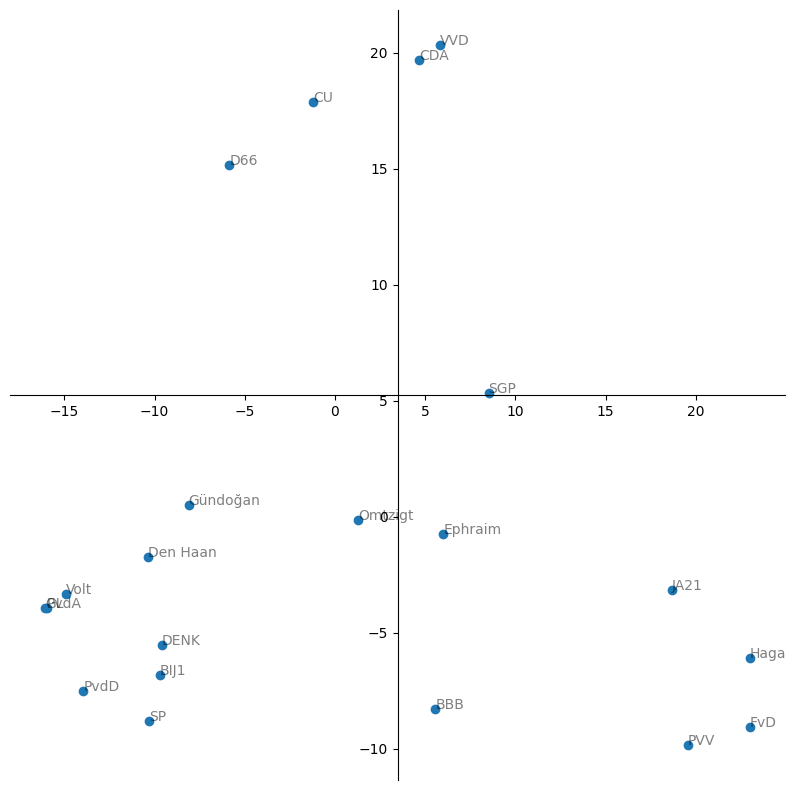

# Moties

Moties en stemgedrag van fracties van Tweede Kamer. Data via `tkapi`, de python interface van de [Tweede Kamer API](https://www.tweedekamer.nl/kamerstukken/open_data).

### installation (linux, python 3.8)

create a virtual environment and install the requirements

    virtualenv -p python3 env
    
    source env/bin/activate

    pip install -r requirements.txt

## Politiek Kompas
Politiek kompas op basis van 1316 moties van januari 2022 tm oktober 2023 (Rutte IV). De x-as is het eerste PCA component, de y-as het tweede. PCA is een statistieke methode om de dimensies van een dataset te reduceren. In dit geval was de dimensie eerst 1316 (voor elke motie heeft een fractie een stem uitgebracht), na PCA is de dimensie 2. Er zit dus **geen** waardeoordeel in de x en y as, het is een statistische representatie van de data.
**Observaties**
* De ratio van verklaarde spreiding is voor PCA1 en PCA2 respectievelijk 0.33 en 0.19. 
* Dat PCA1 (de x-as, die de meeste spreiding in data verklaart) overeenkomt met de algemene opvatting van links en rechts, geeft dus een bevestiging dat dit een zinnige opdeling is.
* De y-as lijkt coalitie/oppositie te volgen. Hoe lager op de y-as, hoe meer een fractie tegen de coalitie in stemt.
* GroenLinks en PvdA liggen praktisch op elkaar. Niet gek, aangezien de partijen vrijwel altijd samen stemmen. Die zouden eens moeten fuseren. 

**Valkuilen**
* Bij een dimensie-reductie van 1316 -> 2 gaat er veel nuance verloren. Specifieke onderwerpen die niet vaak aan bod komen hebben weinig invloed op de positie van een fractie in dit kompas. 
* Ik heb eerlijk gezegd geen idee of ik alle moties heb, of dat ik juist stemmingen heb meegenomen die geen moties zijn.
* Niet alle fracties bestaan evenlang. Bijv. ephraim is in augustus pas afgesplits bij Groep Van Haga.

## Fusies suggereren
Op dit moment is de tweede kamer flink gefragmenteerd. In 2010 waren er 10 fracties, en nu 21.
Met een simpele *KMeans* clustering kunnen we kijken welke fusies de minste compromisssen qua stemgedrag vereisen.
Hiervoor passen we de volgende restricties toe.
* Partijen/leden die niet herverkiesbaar zijn, houden we buiten beschouwing.
* Partijen in de coalitie, die als gevolg van coalitieakkoord vaak samen stemmen, houden we buiten beschouwing.
* Elke partij wordt gewogen met het aantal zetels dat zij heeft. 

### Fusies op volgorde van 'haalbaarheid' 
1. PvdA - GroenLinks
2. PvdA - GroenLinks - Volt
3. BIJ1 - Partij van de Dieren
4. HAGA - JA21

#### Conclusie: 'no free lunch' 
Als maat voor succesvolle fusie kijken we naar het verschil tussen het stemgedrag van voorgestelde fusies en de daadwerkelijke fracties. Zoals in de onderstaande afbeelding te zien is, gaat deze vrijwel linear naar beneden. Dat is geen goed teken voor fusies. Je hoopt eigenlijk op een knik in deze curve, zodat je een fusie kan doen wat de afstand erg vermindert (het zogenaamde hockey-stick punt). Bij de fusie van PvdA-GL (ze stemmen in 97% van de gevallen samen en staan in November 2023 samen op de lijst), zorgt voor een klein knikje, maar niks overduidelijk. 

#### Valkuilen
* alle moties worden gelijk gewogen. Echter zijn sommige moties een stuk belangrijker voor bepaalde partijen. 
* stemgedrag wordt beinvloed door de coalitie. Mogelijk zou een oppositie partij willen fuseren met een coalitiepartij, maar dit is nu niet mogelijk.
